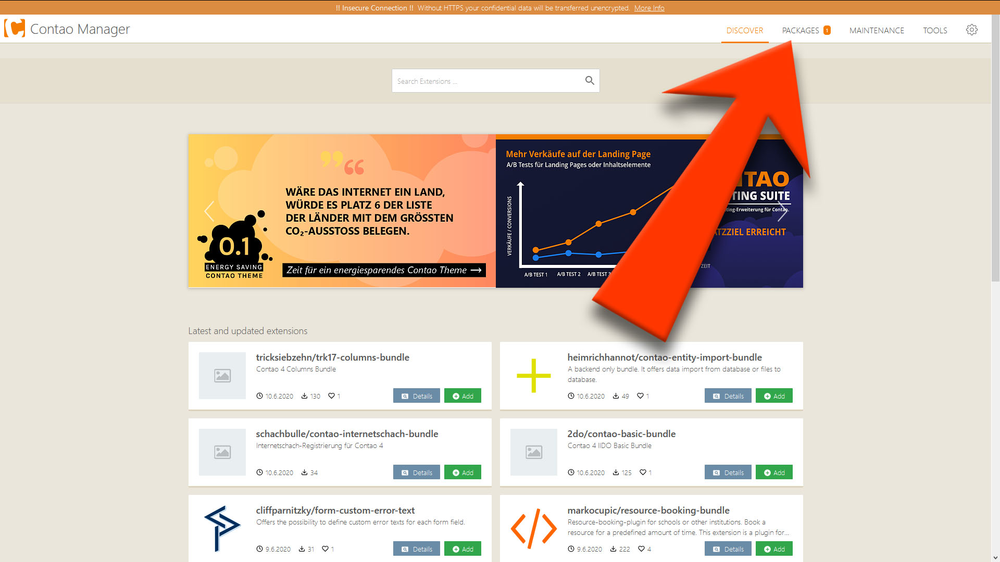
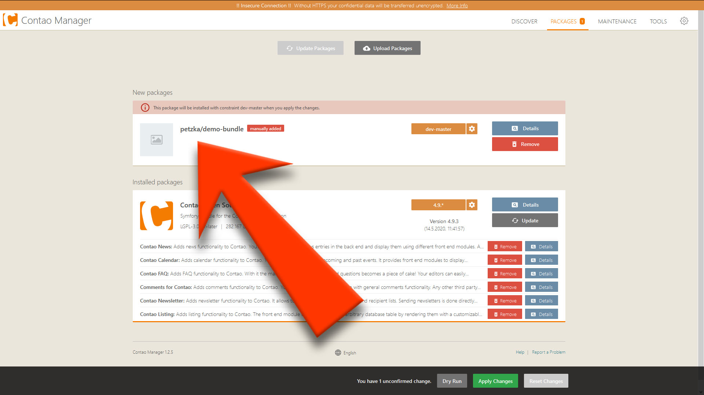
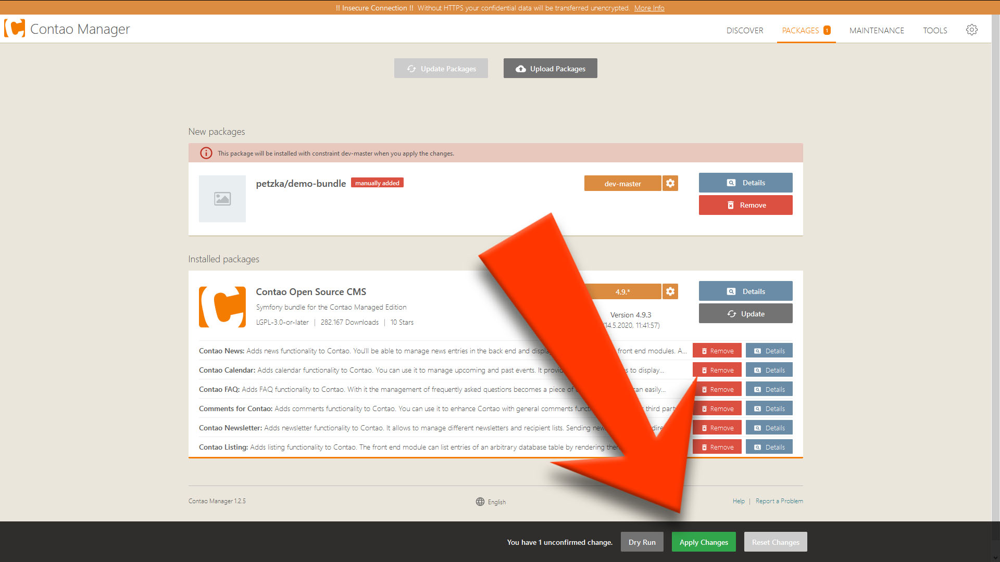
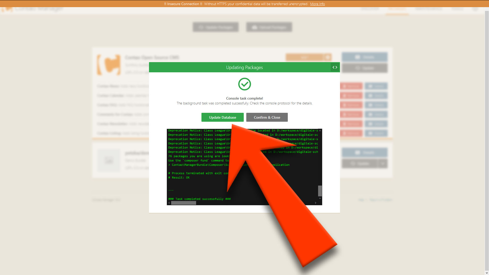
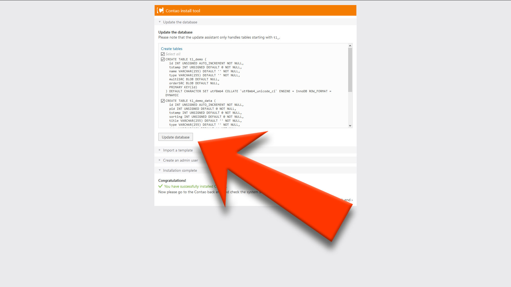
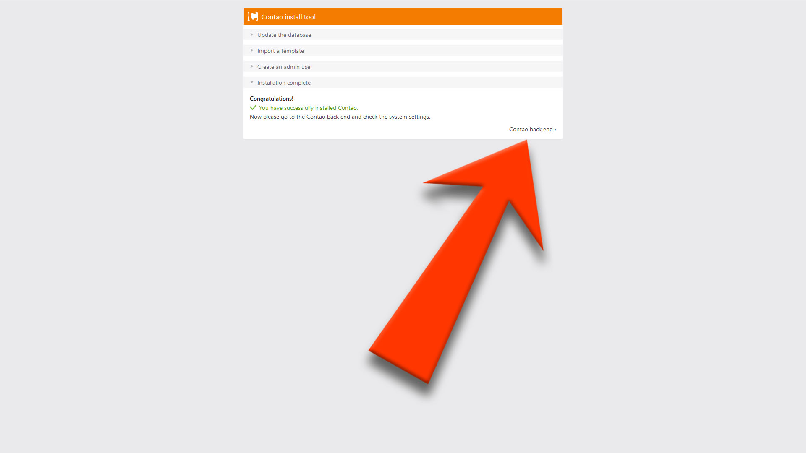
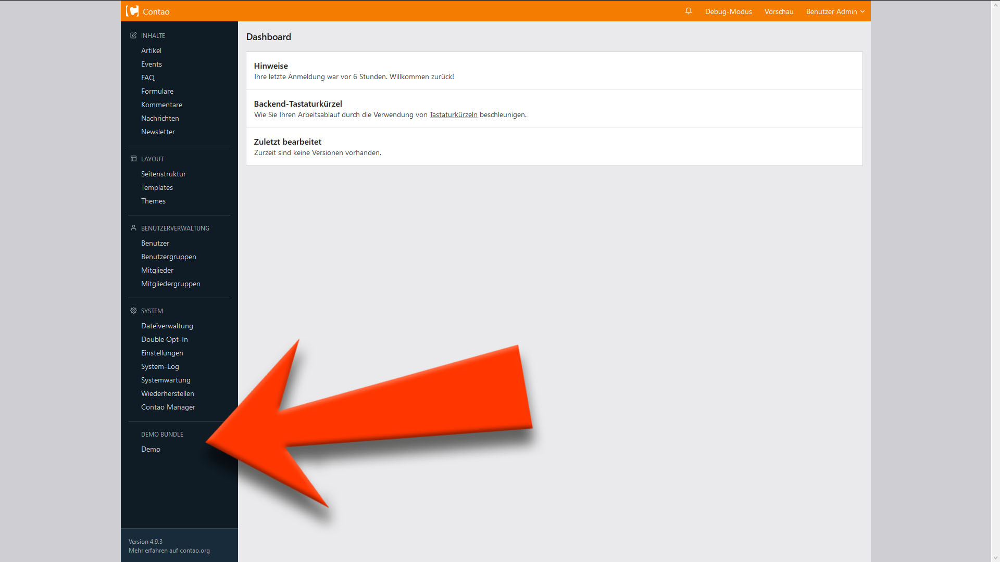

# Contao 4 - Bundle Installation
###### by Moritz Petzka [petzka.com](https://petzka.com) 

<br>

###### Example Contao/Symfony Bundle: <br> [github.com/jodermo/petzka-demo-bundle](https://github.com/jodermo/petzka-demo-bundle)


## Add Bundle as Git-Repository<br>
add code to \<contao root path\>/composer.json
```json
{
    "repositories": [
        {
            "type": "git",
            "url": "https://github.com/jodermo/petzka-demo-bundle.git"
        }
    ],
    "require": {
        "petzka/demo-bundle": "dev-master"
    },
    "config": {
        "preferred-install": {
            "petzka/*": "source",
            "*": "dist"
        }
    },
}
```

##### ! Note: use version prefix `dev-` as long as there is no stable release, e.g:
    "petzka/demo-bundle": "dev-master"

## Add Bundle as local Repository<br>
add code to \<contao root path\>/composer.json
```json
{
    "...": "...",
    "repositories": [
        {
            "type": "path",
            "url": "repositories/petzka-demo-bundle"
        }
    ],
    "require": {
        "...": "...",
        "petzka/demo-bundle": "dev-master"
    },
    "config": {
        "preferred-install": {
            "petzka/*": "source",
            "*": "dist"
        }
    },
}
```

<br>

## Method A: Install Bundle with composer

##### Enter SSH server
```bash
ssh -p 22 -t username@your-domain "cd public_html/www; exec \$SHELL -l"
```
replace: `22` with port number, <br>
`username@your-domain` with your credentials <br>
and: `public_html/www` with path to your contao installation


##### Run composer update

```bash
php composer.phar update
```

<br>

## Method B: Install Bundle with Contao Manager

##### Enter Contao Manager
Type URL `<your domain>/contao-manager.phar.php` in your Browser and enter login credentials to launch Contao Manager


You should see the hint that there is a new package

##### Go to "PACKAGES"

You should see your new package listed

##### Click on "Apply Changes"

That should take a while

##### Click Update database


##### Login to Install Tool and update database


##### Installation done

go to Contao backend

##### Bundle ready


<br>

##### [Troubleshooting](../troubleshooting/README.md)
##### [Overwiev](../..//README.md)

