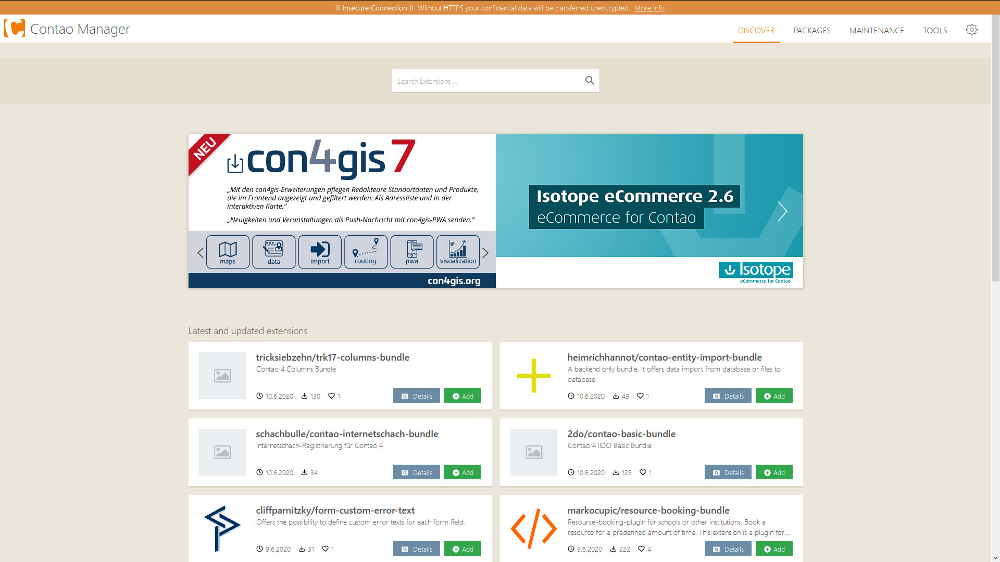
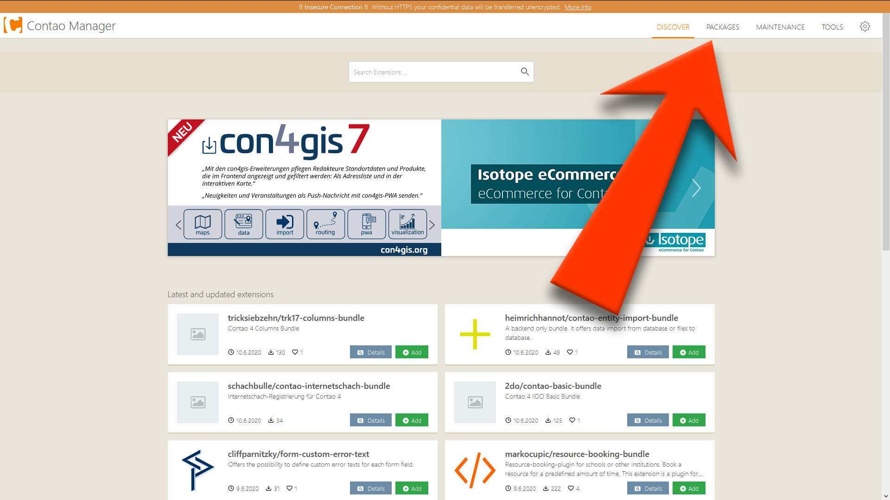
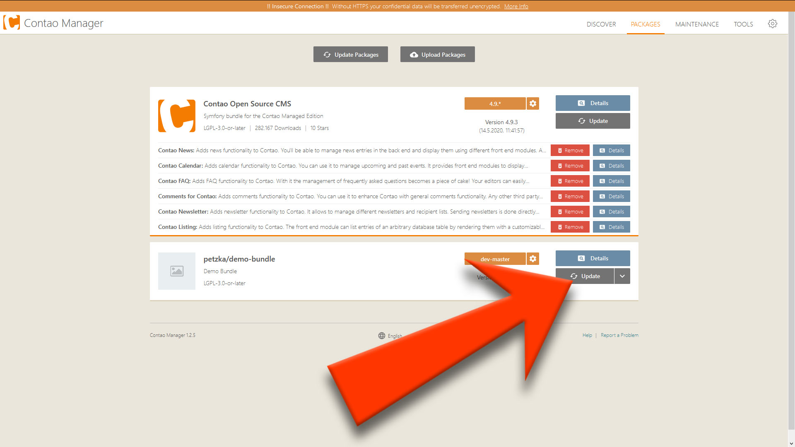
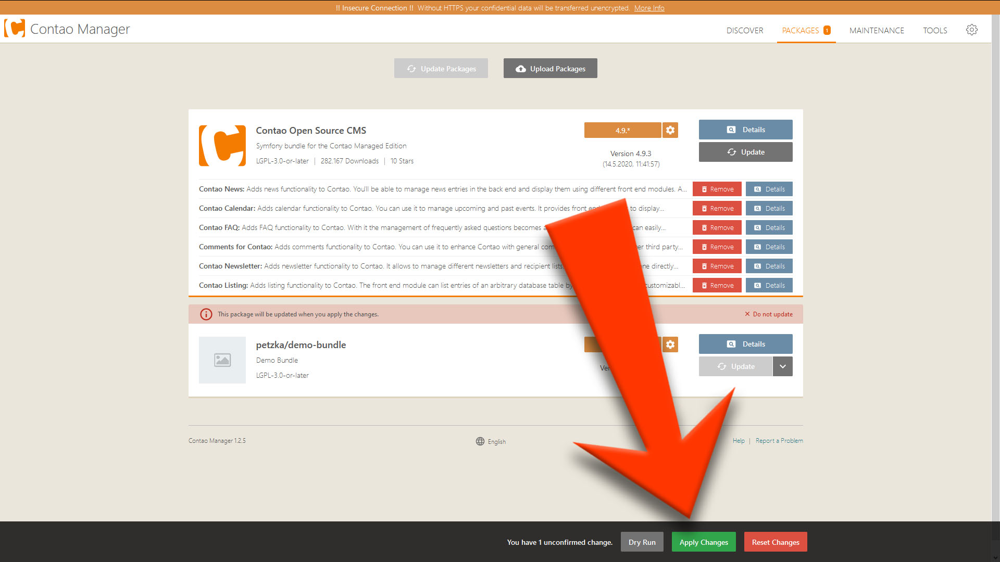

# Contao 4 - Contao Manager
###### by Moritz Petzka [petzka.com](https://petzka.com)

##### For installation, look at: [Install Contao](../contao_installation/README.md)

 

## Enter Contao Manager
Type URL `<your domain>/contao-manager.phar.php` in your Browser and enter login credentials to launch Contao Manager

 

## Update Bundles
##### Go to "PACKAGES"

##### Click on "Update" on Bundle you want update

##### Click on "Apply Changes"

##### Update database

##### [Troubleshooting](../troubleshooting/README.md)
##### [Overwiev](../..//README.md)

