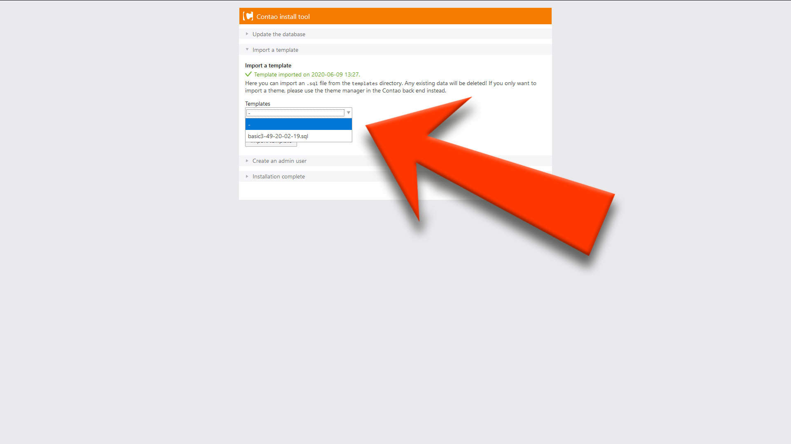

# Contao 4 - Theme installation

 

#### 1. Download and extract Theme

#### 2. Copy theme files to Contao installation
 
#### 3. go to `[your domain]/contao/install` and import the theme template

! Note: All data included existing users will be lost

#### 4. Change admin user password from theme import with phpMyAdmin
search for table `tl_user` and edit `password`

! Note: Password has to be encrypted  
Generate new encrypted password with [https://bcrypt-generator](https://bcrypt-generator.com/)

 

#### • [Documentation Overwiev](../..//README.md)
#### • [Troubleshooting](../troubleshooting/README.md)

######  © 2020 by Moritz Petzka [petzka.com](https://petzka.com) 

